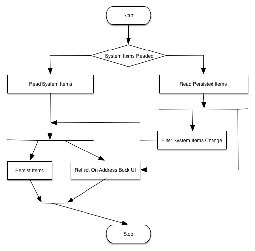

# AddressBookUIDemo

User address book function module like WeChat or Alipay Wallet

### 1. Function Modules

   . Custom user address book data collections
   . Custom user address book UI
   . Supply interface for calling system AddressBookUI.Framework with block callback

### 2. Linked Frameworks or Libraries

   . RHAddresBook
   
     Code: <https://github.com/Soryu/RHAddressBook/>
           https://github.com/heardrwt/RHAddressBook
           
     Docs: http://cocoadocs.org/docsets/RHAddressBook/1.0.3/index.html
    
   . PinYin4Objc
   
     Code: https://github.com/kimziv/PinYin4Objc
    
   . CoreData
    
### 3. Design & Think
   
   . Overall Structure
   
   

### 4. Docs
     
     
    
    
    
    
    
    
    
    
    
    
    
    
    
    
    
    
    
    
    
    
    
    
    
    
    
    
    
    
    
    
    
    
    
    
    
    
    
    
    
    
    
